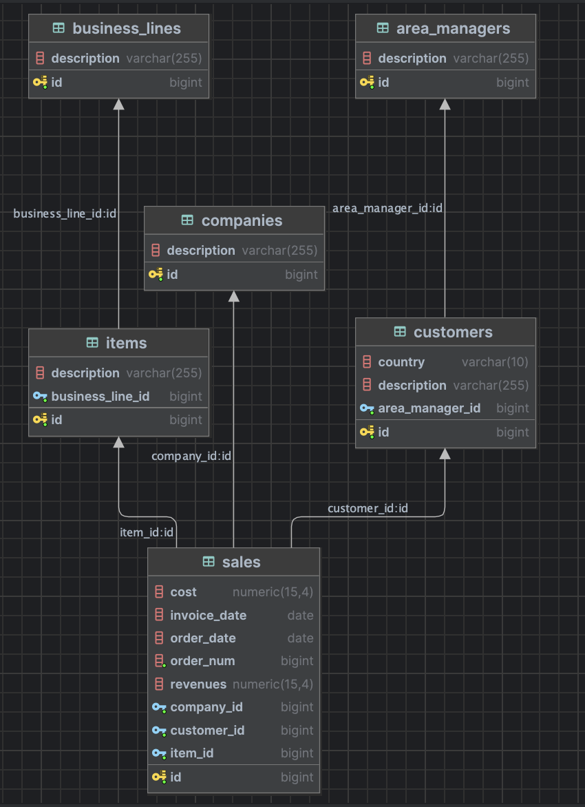

# Cefla Talent - Analisi Vendite & Predictive Analytics (Backend)

Questo repository contiene il backend per la piattaforma di analisi vendite di Cefla. Il sistema è progettato per gestire grandi volumi di dati transazionali, normalizzarli in un database relazionale e fornire insight avanzati attraverso analisi statistiche e modelli predittivi.

## Cosa fa questo Backend?

Il backend si occupa di elaborare i dati di vendita per fornire:
- **Trend Storici**: Analisi mensile di ricavi e margini.
- **Proiezioni Predittive**: Calcolo di trend futuri tramite **Regressione Lineare**.
- **Analisi Stagionale**: Previsioni basate sui cicli storici degli anni precedenti.
- **Modelli Monte Carlo**: Simulazioni per determinare l'incertezza dei ricavi futuri (Min/Max).
- **Churn Risk Analysis**: Identificazione dei clienti a rischio abbandono basata sulla frequenza storica degli ordini e il tempo trascorso dall'ultima transazione.
- **Reporting KPI**: Classifiche dei top performer (clienti, prodotti, area manager) e report dettagliati.

---

## Logica dei Modelli Predittivi

Di seguito i dettagli tecnici su come vengono calcolate le previsioni nel sistema:

### 1. Regressione Lineare (Trend Standard)
Il sistema utilizza il metodo dei **minimi quadrati** per calcolare la retta di regressione ($y = a + bx$):
- **Variabile $x$**: L'indice temporale del mese.
- **Variabile $y$**: Il volume dei ricavi.
- **Proiezione**: La retta viene estesa per i 6 mesi successivi all'ultimo dato disponibile.
- **Costi**: Viene calcolato un *Cost Ratio* medio storico (Totale Costi / Totale Ricavi) e applicato ai ricavi proiettati per stimare i margini futuri.

### 2. Analisi Stagionale (Seasonal Trend)
Per catturare la ciclicità del business (es. picchi a Dicembre o cali estivi):
- **Indici di Stagionalità**: Per ogni mese dell'anno viene calcolato un peso: $\frac{\text{Media Ricavi Mese } X}{\text{Media Ricavi Globale}}$.
- **Baseline**: Viene calcolata la media mobile degli ultimi 3 mesi per riflettere il momentum recente.
- **Calcolo**: La previsione per un mese futuro è data da: $\text{Baseline} \times \text{Indice Stagionalità del Mese}$.
- **Fallback**: Se lo storico è inferiore a 12 mesi, il sistema utilizza automaticamente la Regressione Lineare.

### 3. Simulazione Monte Carlo
Utilizzata per quantificare l'incertezza e il rischio finanziario:
- **Distribuzione**: Il sistema calcola la deviazione standard storica dei ricavi.
- **Simulazione**: Per ogni mese futuro, vengono effettuate **1000 iterazioni** casuali.
- **Rumore Gaussiano**: Ogni iterazione genera un ricavo basato sulla previsione stagionale a cui viene aggiunto un "rumore" casuale che segue una distribuzione normale (basata sulla deviazione standard).
- **Risultato**: Vengono estratti il **5° percentile** (Scenario Worst Case) e il **95° percentile** (Scenario Best Case).

### 4. Churn Risk Analysis (Previsione Abbandono)
Identifica i clienti che potrebbero smettere di acquistare:
- **Intervallo Medio**: Calcola la media dei giorni che intercorrono tra un ordine e l'altro per ogni specifico cliente.
- **Inattività**: Calcola i giorni passati dall'ultima transazione ad oggi.
- **Soglia Critica**: Se l'inattività supera di **1.5 volte** l'intervallo medio del cliente, viene segnalato un rischio.
- **Risk Score**: Il punteggio (da 0 a 1) cresce proporzionalmente al tempo di inattività, raggiungendo il massimo (100%) quando l'inattività triplica l'intervallo medio abituale.

## Requisiti
- **Java 17+**
- **PostgreSQL**
- **Maven** (incluso tramite `mvnw`)

---

## Guida all'Avvio

Segui questi passaggi per configurare ed avviare l'applicazione:

### 1. Preparazione del Database
Crea un database PostgreSQL sul tuo server locale (o dove preferisci). Ad esempio, puoi chiamarlo `cefla_talent`:
```sql
CREATE DATABASE cefla_talent;
```

### 2. Configurazione
Apri il file `src/main/resources/application.properties` e aggiorna le credenziali di accesso al database:
```properties
spring.datasource.url=jdbc:postgresql://localhost:5432/cefla_talent
spring.datasource.username=IL_TUO_UTENTE
spring.datasource.password=LA_TUA_PASSWORD
```
Assicurati che `spring.jpa.hibernate.ddl-auto=update` sia attivo per permettere a Hibernate di creare le tabelle automaticamente al primo avvio.

### 3. Avvio del Backend
Dalla root del progetto, esegui il seguente comando:
```bash
./mvnw spring-boot:run
```
Il backend sarà disponibile all'indirizzo `http://localhost:8080`.

### 4. Avvio del Frontend
Guarda info altra repo

---

## Endpoint di Analisi (REST API)

### 1. Trend e Proiezioni
- `GET /api/reports/trend`: Storico mensile + Proiezione lineare.
- `GET /api/reports/trend/seasonal`: Storico + Proiezione stagionale.

### 2. Previsioni Avanzate
- `GET /api/reports/forecast/advanced`: Dashboard completa con simulazione Monte Carlo e Churn Risk.

### 3. KPI e Ranking
- `GET /api/reports/summary`: Totali globali (Ricavi, Margine, Volume).
- `GET /api/reports/top-performers/{type}`: Classifiche (Tipi: `TOP_CUSTOMERS`, `TOP_ITEMS`, `TOP_AREA_MANAGERS`).
- `GET /api/reports/detailed`: Estrazione completa delle vendite con dettagli anagrafici.

---

## Database Schema

Il database utilizza un modello relazionale ottimizzato per il reporting:
- **`sales`**: Transazioni (ordini, ricavi, costi).
- **`customers`**: Anagrafica clienti (legati a un Area Manager).
- **`items`**: Catalogo prodotti (legati a una Business Line).
- **`companies`**: Entità aziendali.
- **`area_managers`** & **`business_lines`**: Classificazioni per il reporting.


---

## Prossimi Passi

Per l'evoluzione del progetto, i principali interventi previsti riguardano il refactoring e la manutenibilità del codice:
- **Riorganizzazione dei Service**: Pulizia e suddivisione delle logiche di business attualmente concentrate in pochi service.
- **Modularizzazione**: Suddivisione in classi specializzate per separare meglio le responsabilità (es. separare la logica puramente statistica da quella di accesso ai dati).
- **Ottimizzazione**: Miglioramento delle performance di calcolo per dataset ancora più ampi.